# Guía para la Instalación y Configuración de LDAP Account Manager y phpLDAPAdmin en Ubuntu Server 24

## Instalación y Configuración Inicial de LDAP Account Manager

1. **Actualizar el Sistema y Repositorios**
   - Ejecuta una actualización de los repositorios y paquetes para garantizar que el sistema esté al día:
     ```bash
     sudo apt update && sudo apt upgrade -y
     ```

2. **Instalar el Servidor Web y Dependencias**
   - Para acceder a la interfaz de gestión de LDAP desde otros dispositivos, instala Apache y las dependencias de PHP necesarias:
     ```bash
     sudo apt install apache2 php php-cli libapache2-mod-php php-mbstring php-common php-pear -y
     ```
   - Habilita `php-cgi`:
     ```bash
     sudo a2enconf php8.3-cgi
     ```
   - Reinicia Apache para aplicar los cambios:
     ```bash
     sudo systemctl reload apache2
     ```

3. **Instalación de LDAP Account Manager**
   - Instala LDAP Account Manager (LAM) con el siguiente comando:
     ```bash
     sudo apt install ldap-account-manager -y
     ```

4. **Configuración Inicial de LAM**
   - Edita el archivo de configuración de Apache para LAM en `/etc/apache2/conf-enabled/ldap-account-manager.conf`:
     - Añade las IPs locales y el rango de red para permitir el acceso.
     - Guarda los cambios y reinicia Apache:
       ```bash
       sudo systemctl restart apache2
       ```
   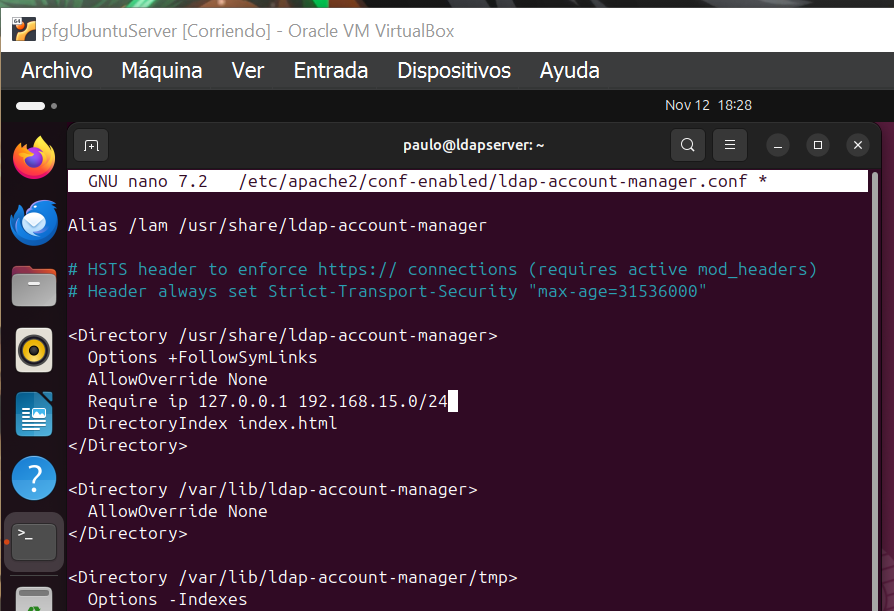
   - Accede a LAM en `http://localhost/lam` y cambia la contraseña por defecto desde la sección "LAM Configuration".
   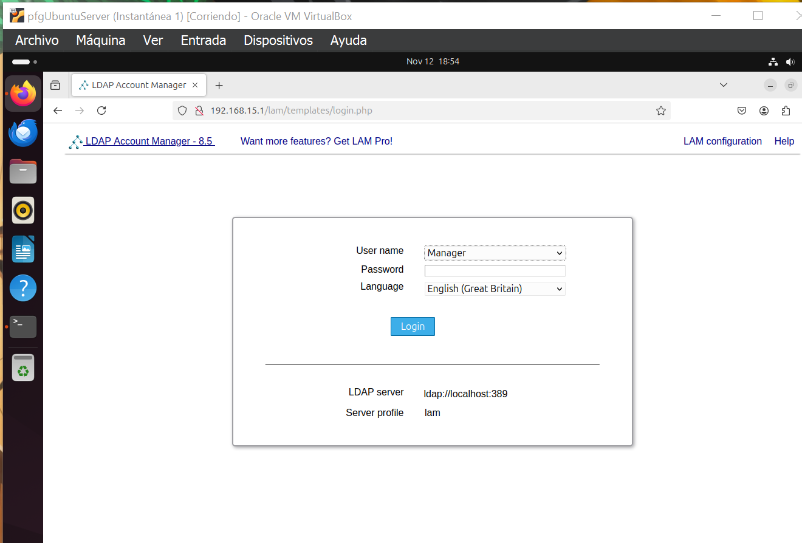
   - En "Tool settings", añade el sufijo del dominio en "Tree suffix" y especifica el usuario administrador en "List of valid users" dentro de "Server settings".
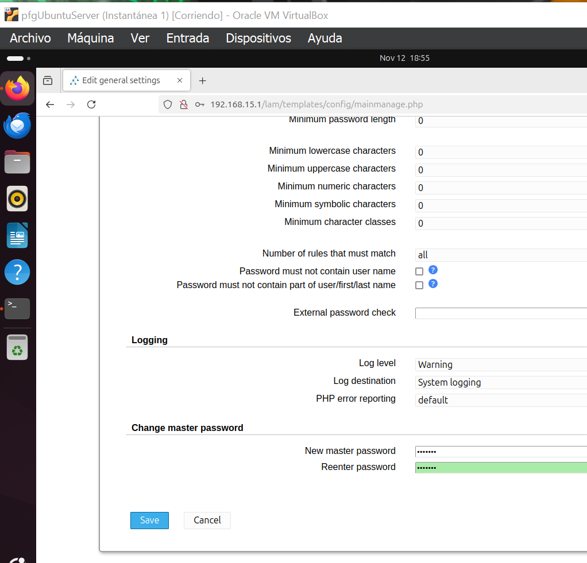
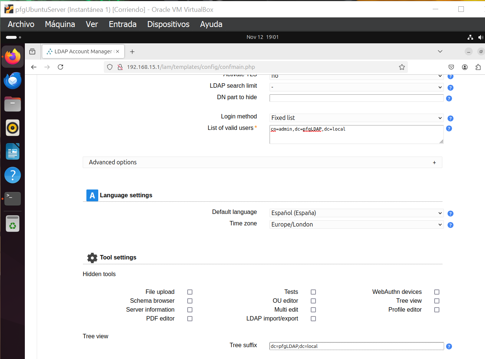
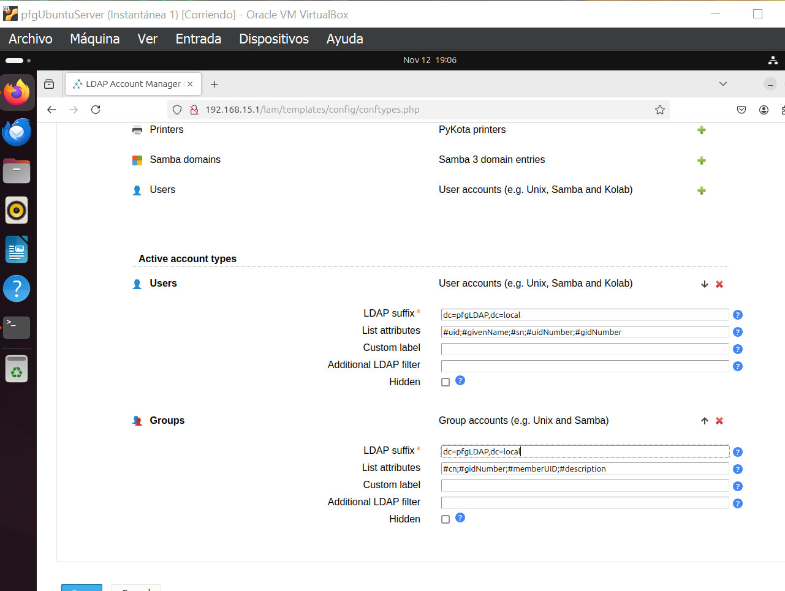
## Eliminación de la Infraestructura Anterior

- Elimina la infraestructura creada en la Actividad 1.1 accediendo a las opciones de eliminación de usuarios, grupos y OUs desde el editor de LDAP Account Manager.
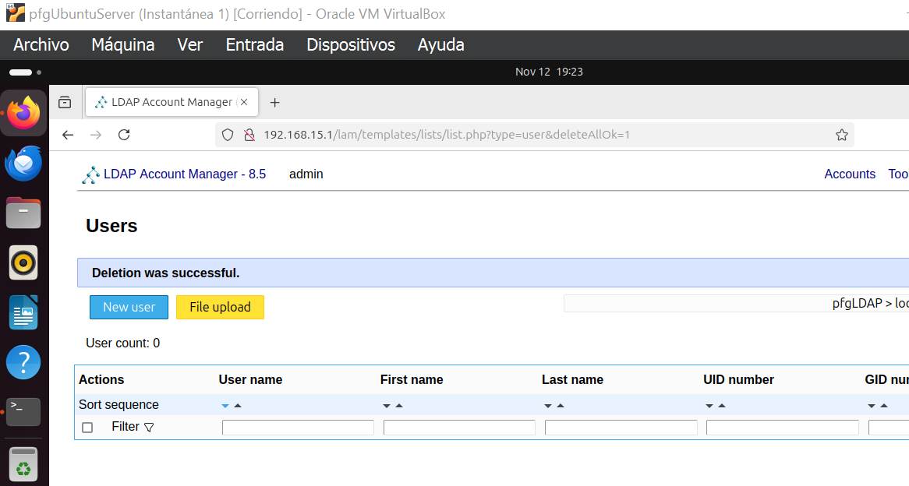
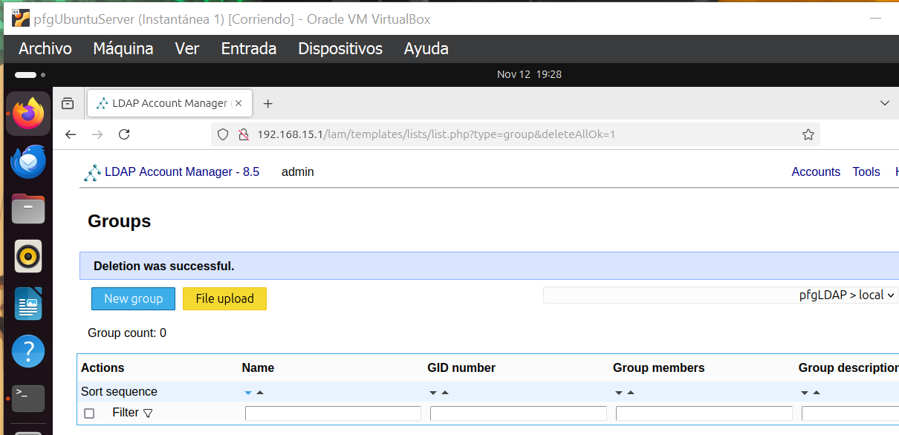
## Creación de Nueva Infraestructura en LDAP Account Manager

1. **Definición del Problema**
   - Se desea crear una estructura de usuarios y grupos para una empresa con los siguientes departamentos:
     
   
2. **Creación de OUs y Grupos**
   - Desde la interfaz de LAM, crea una OU principal 
   - Dentro de esta OU, añade sub-OUs para cada departamento 
   - Luego, crea los grupos requeridos dentro de cada departamento.
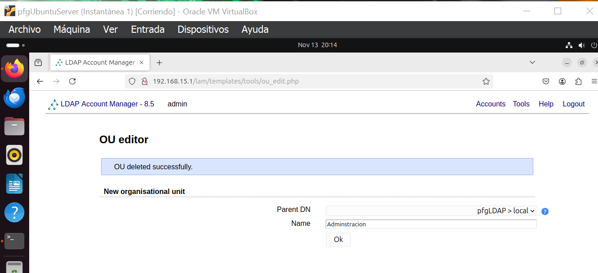
3. **Creación de Usuarios**
   - Agrega 15 usuarios distribuidos entre los grupos y OUs definidos.
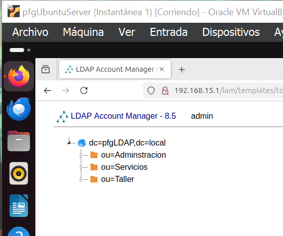
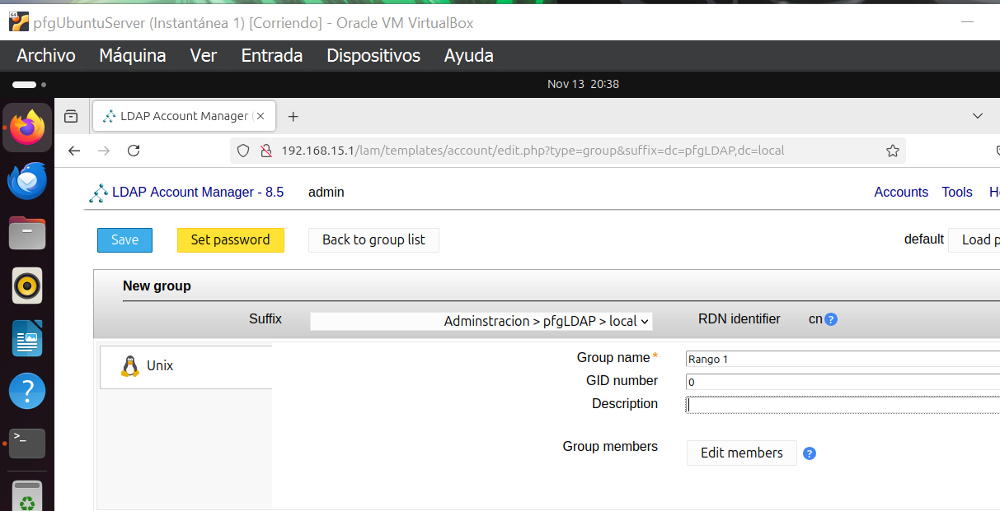
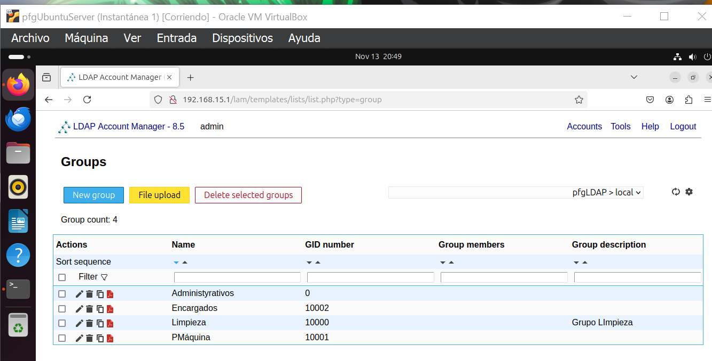
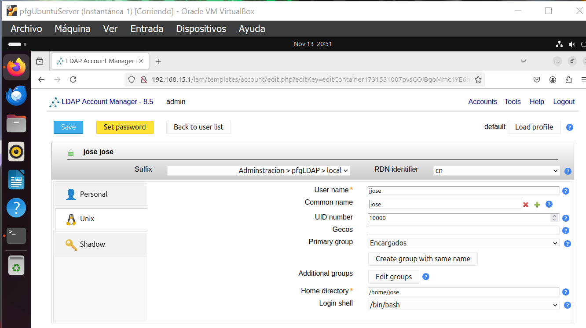
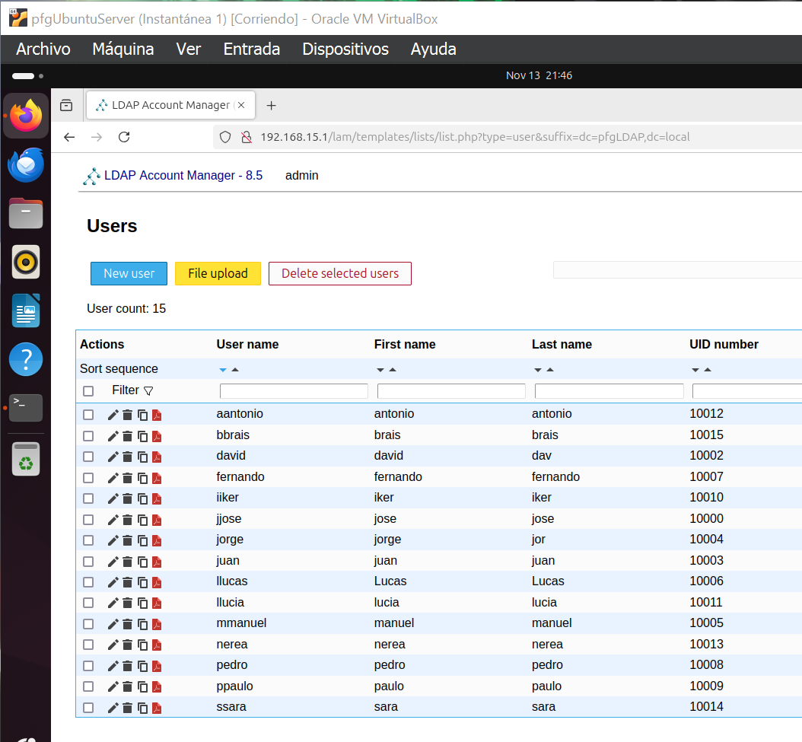
4. **Instantánea (Snapshot)**
   - Realiza un snapshot de la máquina virtual para conservar el estado actual de la configuración.

## Instalación y Configuración de phpLDAPAdmin

1. **Instalación de phpLDAPAdmin**
   - Para instalar phpLDAPAdmin, usa el siguiente comando:
     ```bash
     sudo apt install phpldapadmin -y
     ```

2. **Configuración de phpLDAPAdmin**
   - Edita el archivo de configuración en `/etc/phpldapadmin/config.php`:
     - Introduce el nombre de dominio.
   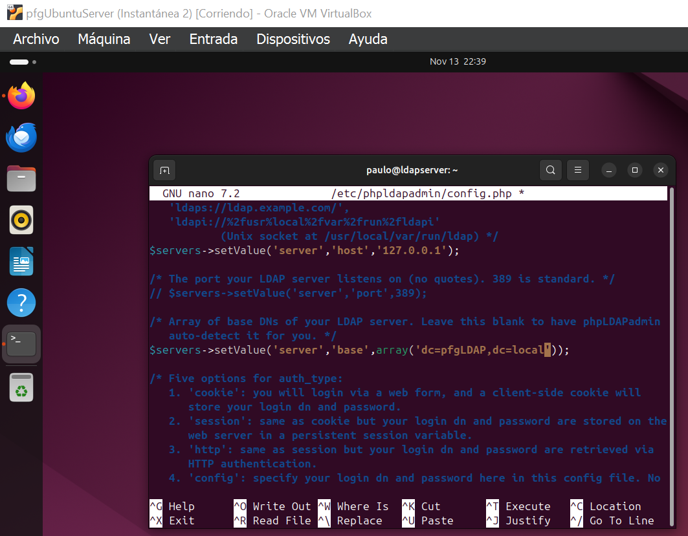

   - Reinicia Apache:
     ```bash
     sudo systemctl restart apache2
     ```
   - Accede a phpLDAPAdmin desde `http://localhost/phpldapadmin` y conecta usando tus credenciales.

## Eliminación y Recreación de Infraestructura en phpLDAPAdmin

1. **Eliminación de Infraestructura Existente**
   - Elimina usuarios, grupos y OUs seleccionando cada elemento en el árbol del dominio y eligiendo "Borrar este objeto" desde el menú de opciones.
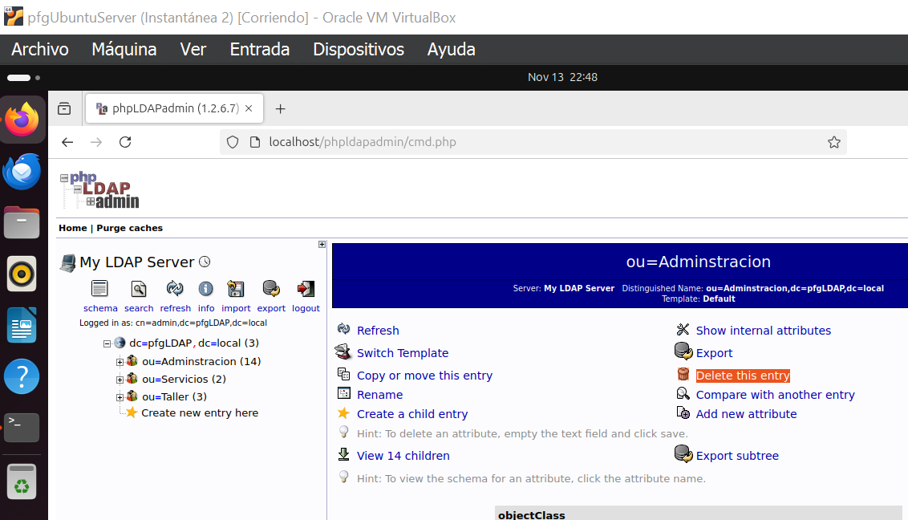

2. **Recreación de la Estructura**
   - Para crear nuevas OUs, grupos y usuarios:
     - Selecciona el elemento padre correspondiente en el árbol y elige "Crear un objeto hijo".
     - Para OUs, selecciona "Unidad Organizativa".
     - Para grupos, elige "Genérico: Grupo Posix".
     - Para usuarios, selecciona "Genérico: Cuenta de Usuario".
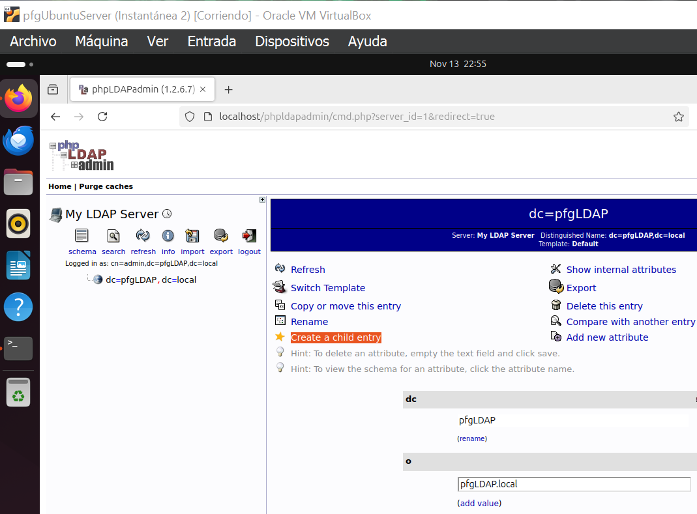
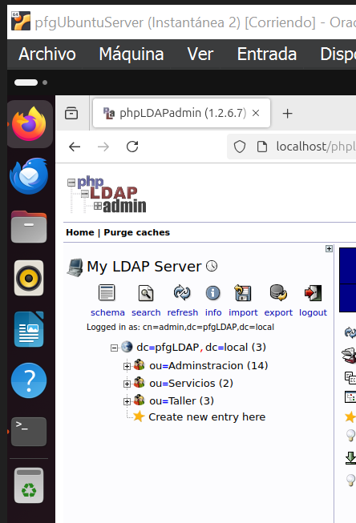

## Documentación y Entrega

1. **Documentación en GitHub**
   - Crea un directorio `LDAP-Account-Manager-e-phpLDAPAdmin` en tu repositorio privado de GitHub.
   - Dentro de este directorio, usa `README.md` para documentar el proceso.
   - Agrega una carpeta `img` para capturas de pantalla.
   - Utiliza Markdown PDF en VS Code para convertir el `README.md` a PDF y nómbralo como `actividad-1.2-LDAP-Account-Manager-e-phpLDAPAdmin-apellido1-apellido2-nombre.pdf`.

2. **Entrega Final**
   - Proporciona la URL del directorio en GitHub y el PDF convertido.

