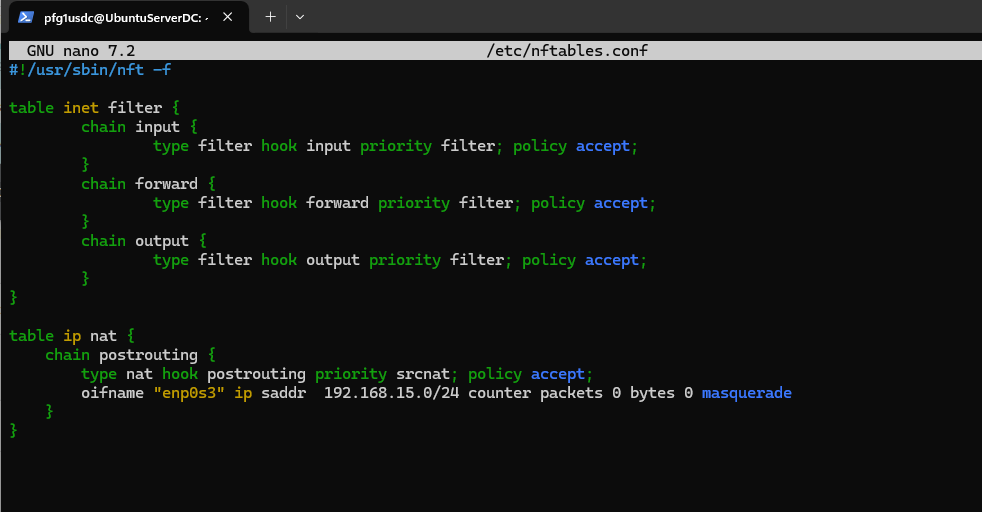

# Configuración de Samba Active Directory y Recursos Compartidos

## Pasos Previos

1. **Configurar `nftables` en el servidor**
   - Modifica el archivo de configuración del firewall `nftables` en el servidor.  
     

2. **Editar el archivo `/etc/hosts`**
   - Añade las entradas necesarias al archivo `/etc/hosts`.  
     

3. **Configurar IP en el cliente**
   - Asigna la dirección IP correspondiente al cliente.  
     

4. **Verificar la conexión a internet**
   - Comprueba que el cliente tiene acceso a internet a través del servidor.

5. **Instalar servicio SSH**
   - Instala el servicio SSH para trabajar desde PowerShell en adelante.  
     

6. **Instalar Samba en el cliente**
   - Ejecuta el siguiente comando en el cliente:
     ```bash
     sudo apt install realmd sssd samba-common samba-common-bin libpam-sss libnss-sss
     ```
   - Descubre el dominio con:
     ```bash
     realm discover dominio.local
     ```
   - Une el cliente al dominio Samba.  
       
     

7. **Verificación**
   - Asegúrate de que el cliente se ha unido correctamente al dominio.  
     

## Actividad 3.2 - Recursos Compartidos en Samba 4 AD

### Corrección de `/etc/hosts`

**Problema:** En la actividad 3.1, se utilizó en exceso `/etc/hosts` para resolver nombres de dominio y apuntar al DC. Esto es inadecuado, ya que este archivo es estático y no permite resolución dinámica.

**Solución:** Configurar correctamente `/etc/resolv.conf` para usar el DNS de Samba.

- **Eliminar líneas innecesarias**, como:
  ```bash
  192.168.15.8    UbuntuServerDC.pfgASO.local UbuntuServerDC
  ```

- **Verificar resolución de nombres** con:
  ```bash
  nslookup UbuntuServerDC.pfgASO.local
  dig UbuntuServerDC.pfgASO.local
  ```

- **Comprobar conectividad** mediante:
  ```bash
  ping -c 4 UbuntuServerDC.pfgASO.local
  ```
  

## Infraestructura AD con `samba-tool`

**Objetivo:** Crear 3 grupos y asignar usuarios según los criterios dados.

1. **Crear Grupos**
   - Crea los grupos necesarios.  
     

2. **Añadir Usuarios**
   - Asigna usuarios a los grupos definidos.
   - Asegúrate de incluir un usuario en todos los grupos para pruebas.

3. **Verificación**
   - Comprueba la configuración.  
     

## Configuración de Recursos Compartidos

1. **Crear Recursos Compartidos**
   - Crea la carpeta base `/NASpfg` para los recursos compartidos.  
       
     

2. **Configurar Subcarpetas y Permisos**
   - Define subcarpetas para cada recurso compartido y configura los permisos.

3. **Editar el archivo de configuración de Samba**
   - Añade bloques específicos para cada recurso compartido:
     ```plaintext
     [Recur1]
     path = /NASpfg/recur1
     read only = no
     valid users = @basico
     ```
     - **`path`**: Especifica la ubicación del recurso compartido en el servidor.
     - **`read only`**: Define si es de solo lectura (`yes`) o permite escritura (`no`).
     - **`valid users`**: Controla el acceso. En este caso, solo los usuarios del grupo `basico` tienen acceso.

4. **Reiniciar Servicios**
   - Aplica los cambios con:
     ```bash
     sudo systemctl restart smbd nmbd
     ```
     

