# Pasos Previos

Para empezar crearemos y configuraremos tanto un Ubuntu Server como un Ubuntu Desktop. Destacaremos poner una tarjeta en modo adaptador solo anfitrión para posteriormente conectarnos por SSH a nuestro equipo.

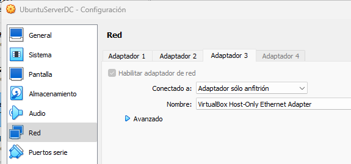

A continuación accederemos a nuestro servidor mediante SSH:

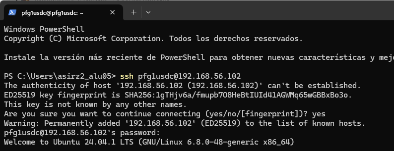

## Configuración del servidor

1. Cambiar el hostname del servidor:

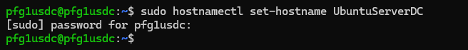

2. Modificar el archivo de hosts para mapear el hostname y el dominio:

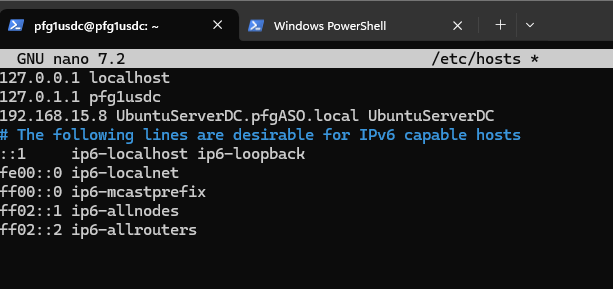

3. Verificar si el FQDN resuelve la IP de Samba:

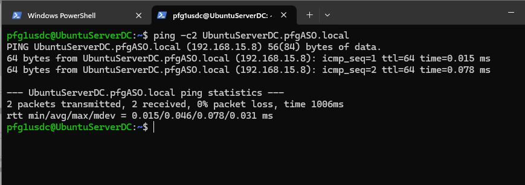

4. Desactivar el servicio systemd-resolved y configurar el archivo `resolv.conf`:

```bash
sudo systemctl disable --now systemd-resolved
sudo unlink /etc/resolv.conf
sudo nano /etc/resolv.conf

sudo chattr +i /etc/resolv.conf
```

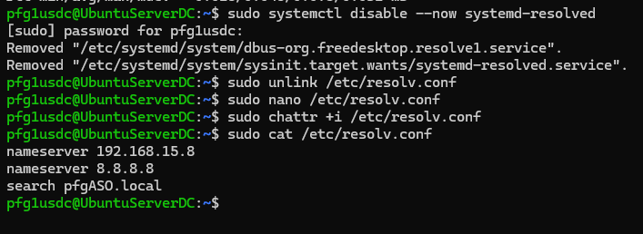

## Instalación de Samba

1. Instalar Samba con sus paquetes y dependencias:

```bash
sudo apt install -y acl attr samba samba-dsdb-modules samba-vfs-modules smbclient winbind libpam-winbind libnss-winbind libpam-krb5 krb5-config krb5-user dnsutils chrony net-tools
```

2. Deshabilitar los servicios innecesarios (`smbd`, `nmbd`, `winbind`) y habilitar `samba-ad-dc`:

```bash
sudo systemctl disable --now smbd nmbd winbind
sudo systemctl unmask samba-ad-dc
sudo systemctl enable samba-ad-dc
```

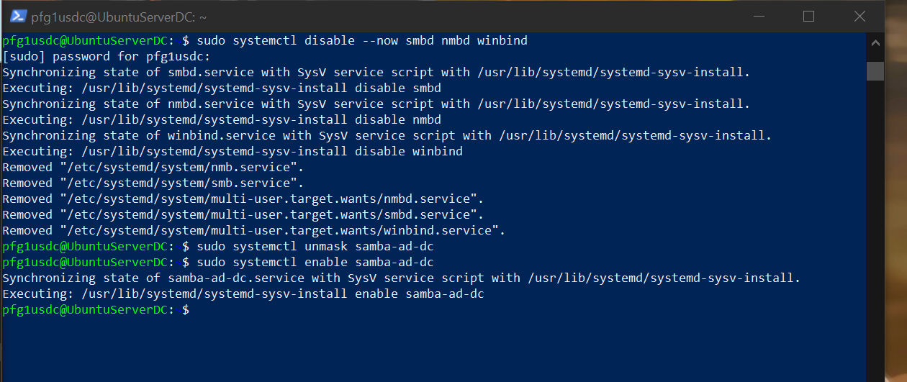

## Configuración de Samba como Active Directory

1. Crear una copia de seguridad del archivo de configuración `smb.conf`:

```bash
sudo mv /etc/samba/smb.conf /etc/samba/smb.conf.orig
```

2. Provisionar Samba Active Directory:

```bash
sudo samba-tool domain provision
```

Configura los siguientes parámetros durante la provisión:
- Realm: PFGASO.LOCAL
- Domain: PFGASO
- Server Role: dc
- DNS backend: SAMBA_INTERNAL
- DNS forwarder IP address: 8.8.8.8

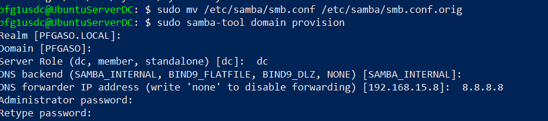

3. Configurar Kerberos:

```bash
sudo mv /etc/krb5.conf /etc/krb5.conf.orig
sudo cp /var/lib/samba/private/krb5.conf /etc/krb5.conf
```

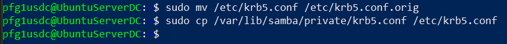

4. Iniciar el servicio Samba AD:

```bash
sudo systemctl start samba-ad-dc
sudo systemctl status samba-ad-dc
```

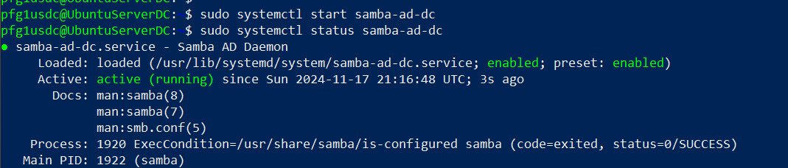

## Configurar sincronización de tiempo

1. Configurar permisos para el directorio `ntp_signd`:

```bash
sudo chown root:_chrony /var/lib/samba/ntp_signd/
sudo chmod 750 /var/lib/samba/ntp_signd/
```

2. Modificar el archivo de configuración de `chrony`:

```bash
sudo nano /etc/chrony/chrony.conf
```

Agrega las siguientes líneas:

```plaintext
bindcmdaddress 192.168.15.8
allow 192.168.15.0/24
ntpsigndsocket /var/lib/samba/ntp_signd
```

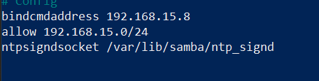

3. Reiniciar y verificar el servicio `chronyd`:

```bash
sudo systemctl restart chronyd
sudo systemctl status chronyd
```

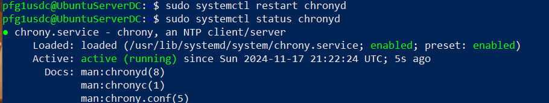

## Verificar Samba Active Directory

1. Verificar los nombres de dominio:

```bash
host -t A pfgASO.local
host -t A UbuntuServerDC.pfgASO.local
```

2. Verificar los registros de servicio Kerberos y LDAP:

```bash
host -t SRV _kerberos._udp.pfgASO.local
host -t SRV _ldap._tcp.pfgASO.local
```

3. Verificar los recursos en Samba AD:

```bash
smbclient -L pfgASO.local -N
```

4. Comprobar autenticación en Kerberos:

```bash
kinit administrator@PFGASO.LOCAL
klist
```

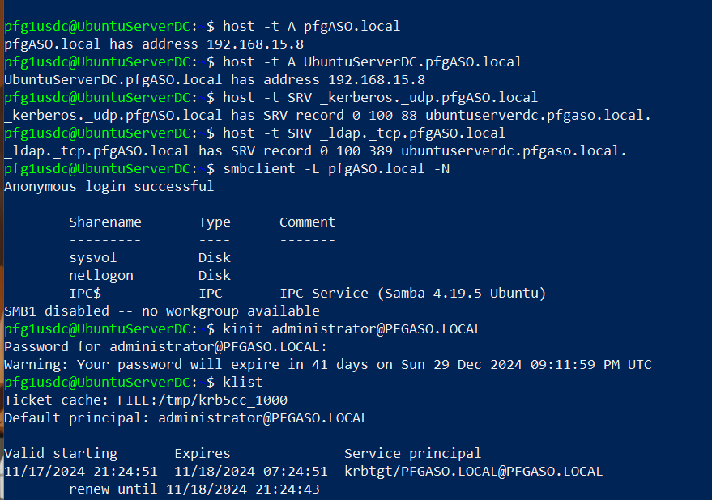

5. Iniciar sesión en Samba a través de SMB:

```bash
sudo smbclient //localhost/netlogon -U 'administrator'
```

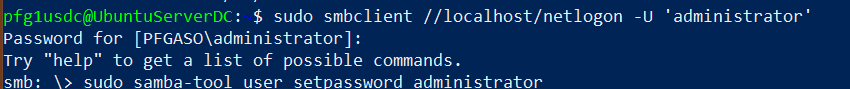

6. Cambiar contraseña de usuario `administrator`:

```bash
sudo samba-tool user setpassword administrator
```

7. Verificar la configuración de Samba:

```bash
testparm
```

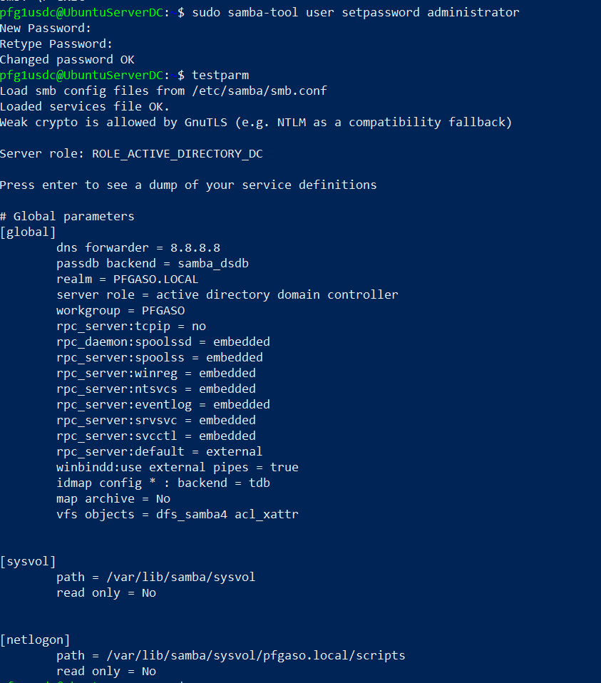

## Gestión de usuarios y grupos

1. Crear usuario en Samba AD:

```bash
sudo samba-tool user create clockworker
```

2. Listar usuarios en Samba AD:

```bash
sudo samba-tool user list
```

3. Eliminar un usuario:

```bash
sudo samba-tool user delete <nombre_del_usuario>
```

4. Listar equipos en Samba AD:

```bash
sudo samba-tool computer list
```

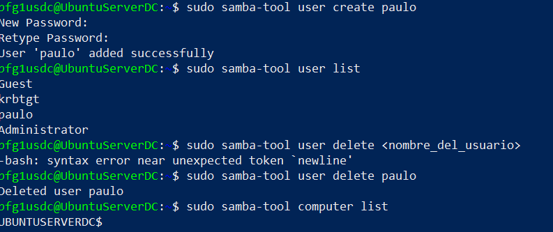

5. Eliminar un equipo:

```bash
sudo samba-tool computer delete <nombre_del_equipo>
```

6. Crear grupo en Samba AD:

```bash
samba-tool group add <nombre_del_grupo>
```

7. Listar grupos:

```bash
samba-tool group list
```

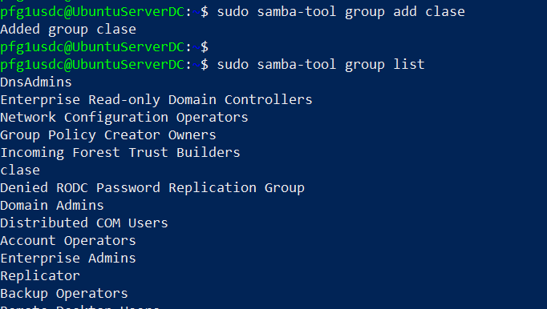

8. Listar miembros de un grupo:

```bash
samba-tool group listmembers 'Domain Admins'
```

9. Agregar un miembro a un grupo:

```bash
samba-tool group addmembers <nombre_del_grupo> <nombre_del_usuario>
```

10. Eliminar un miembro de un grupo:

```bash
samba-tool group removemembers <nombre_del_grupo> <nombre_del_usuario>

