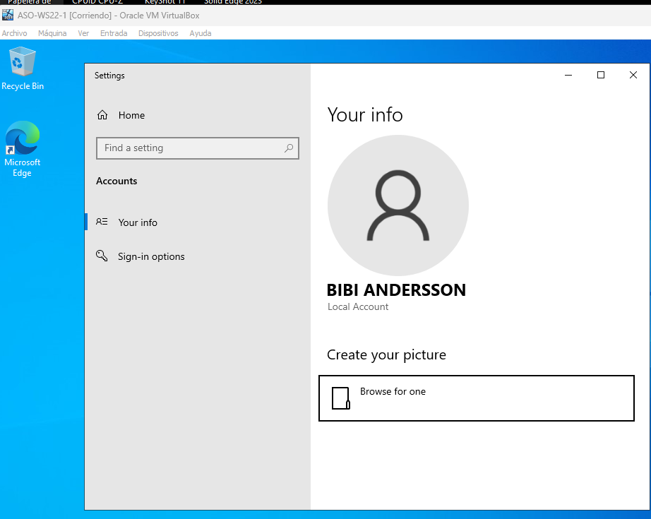

# Actividad 1.1 - Administración básica de WS 2022

En esta actividad deberás realizar las siguientes tareas:

## 1. Instale Windows Server 2022 en una máquina virtual VirtualBox

Intenta seguir las convenciones comentadas en clase basadas en el documento "Gestión de VM con VirtualBox".

## 2. Elimina la necesidad de utilizar CTRL+ALT+DEL para ingresar credenciales y acceder al sistema.

1. Ve a **Herramientas administrativas**.
2. Abre el **Editor de directivas de seguridad local**.
3. Navega hasta **Políticas locales > Opciones de seguridad**.
4. Busca la opción **Inicio de sesión interactivo: no requerir CTRL+ALT+DEL** y habilítala.

## 3. Modificar las directivas de contraseñas

1. Abre el **Editor de directivas de grupo**.
2. Ve a **Configuración del equipo > Configuración de Windows > Configuración de seguridad > Directivas de cuenta > Directiva de contraseñas**.
3. Modifica la **vigencia mínima** a 15 días y la **vigencia máxima** a 60 días.

## 4. Agregue 3 nuevos usuarios al sistema: Larisa Shepitko, Bibi Andersson y Monica Vitti

1. Abre el **Administrador de usuarios y grupos locales**.
2. Crea 3 nuevos usuarios:
    - Larisa Shepitko
    - Bibi Andersson
    - Monica Vitti
3. Establece una contraseña para cada uno.
4. Verifica que puedan iniciar sesión.

## 5. Agregue 2 grupos llamados "directoras" y "actrices"

1. Crea dos nuevos grupos: **directoras** y **actrices**.
2. Agrega a **Larisa Shepitko** al grupo de **directoras**.
3. Agrega a **Bibi Andersson** y **Monica Vitti** al grupo de **actrices**.

---

## 6. Agregue la característica de "Copias de Seguridad de Windows Server"

1. Ve al **Administrador del Servidor**.
2. Haz clic en **Agregar roles y características**.
3. Selecciona **Windows Server Backup** y sigue las instrucciones.

---

## 7. Establezca cuotas de disco para las carpetas personales de los usuarios

1. Abre **Administrador de recursos del servidor de archivos**.
2. Establece las siguientes cuotas:
    - **100 MB** para Bibi Andersson y Monica Vitti.
    - **200 MB** para Larisa Shepitko.
3. Verifica que se cumplan.

---

## 8. Cree las siguientes carpetas y asigne permisos especiales

1. **the-ascent-1977** para Larisa Shepitko - Control total.
2. **persona-1966** para Bibi Andersson - Lectura y ejecución.
3. **l'avventura-1960** para Monica Vitti - Solo lectura.

---

## 9. Enumere los servicios que se inician automáticamente al iniciar la computadora

1. Abre el **Administrador de tareas**.
2. Ve a la pestaña **Servicios** y revisa los servicios con inicio automático.

## 10. Crear una tarea programada para recordarnos cada hora

1. Abre **Programador de tareas**.
2. Crea una nueva tarea que muestre un mensaje con el texto: **"Debo ver The Conversation (1974) esta noche"** cada hora.

---

## 11. Monitor de Rendimiento

1. Abre **Monitor de rendimiento**.
2. Muestra información sobre el **disco físico**, **procesador**, **interfaz de red** y **memoria**.

---

## 12. ¿Cómo podemos saber cuáles son los 5 procesos con mayor consumo de CPU, disco y memoria?

1. Abre el **Administrador de tareas**.
2. Ve a la pestaña **Rendimiento** y ordena los procesos por **CPU**, **disco** y **memoria**.

---

## 13. Crear una copia de seguridad de las carpetas personales de Larisa Shepitko y Bibi Andersson

1. Usa **Windows Server Backup** para hacer una copia de seguridad de las carpetas personales de **Larisa Shepitko** y **Bibi Andersson**.

---

## 14. Disminuir la prioridad de Bloc de Notas a "Below Normal"

1. Abre el **Administrador de tareas**.
2. Encuentra el proceso de **Notepad**.
3. Haz clic derecho y selecciona **Set Priority** > **Below Normal**.

