# Actividad 6.1 - Integración de equipos Windows en Samba AD con Ubuntu Server

## Paso 1: Agregar Windows 10 al dominio

1. Abre la configuración de red en Windows 10 y configúrala correctamente:
   
   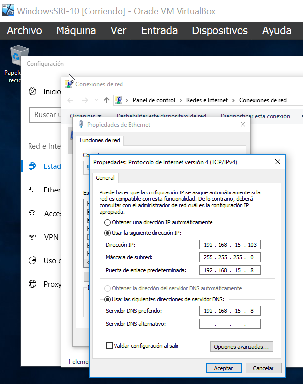

2. Ahora procederemos a unir el equipo al dominio:

   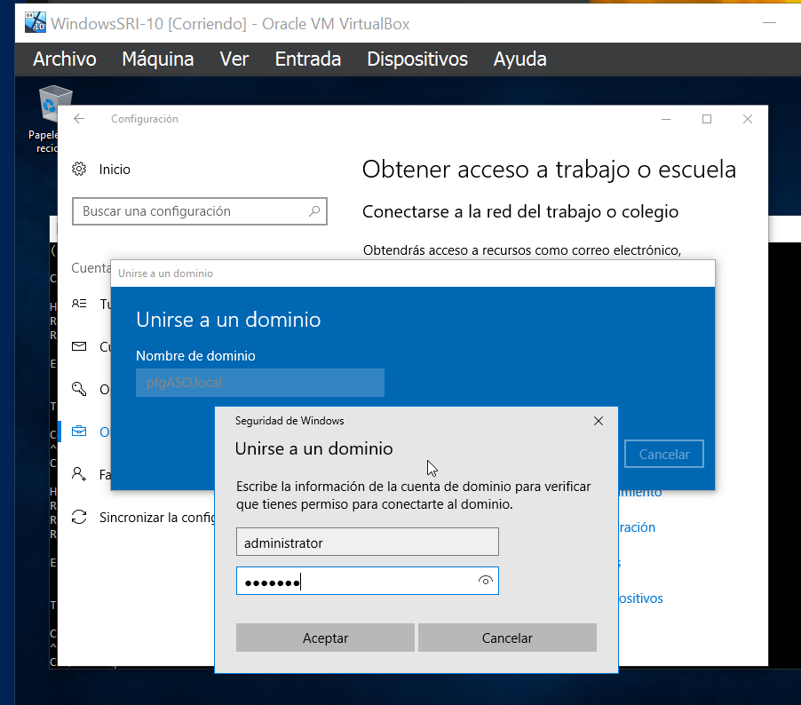

   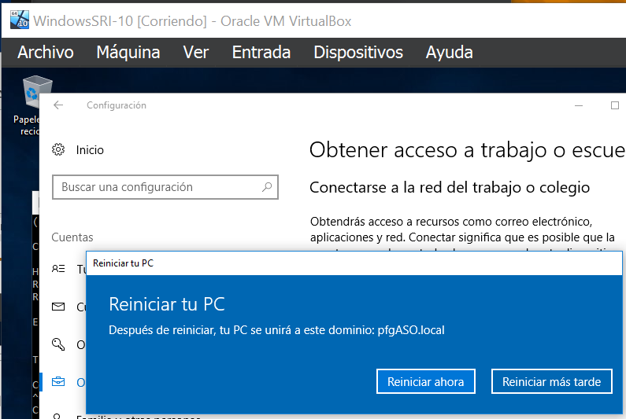

3. Comprobaremos desde nuestro servidor que se haya unido correctamente:

   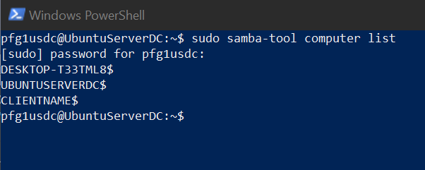

## Paso 2: Comprobar autenticación y acceso a recursos compartidos

1. Accede al equipo Windows con un usuario de Samba para verificar la autenticación:

   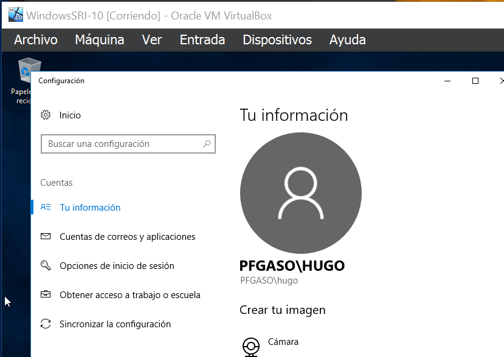

2. Verifica los permisos de acceso a los recursos compartidos. Por ejemplo, el usuario "hugo" no tiene acceso a la carpeta "recur1" porque no tiene permisos:

   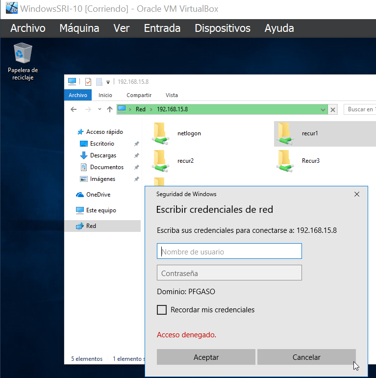

## Paso 3: Permitir pings en Windows

1. Configurar el firewall para permitir ICMP:
   - Abre el Firewall de Windows con Seguridad Avanzada.
   - Habilita las reglas de entrada para ICMP:

   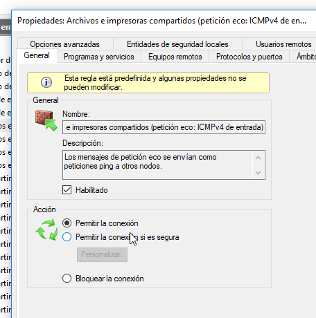

2. Comprueba la conectividad mediante ping:

   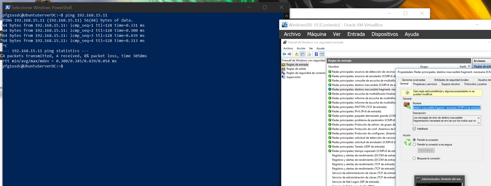

## Paso 4: Instalar y Configurar DHCP y DNS en Ubuntu Server

### Instalar paquetes necesarios

1. Instala los servicios necesarios en el servidor Ubuntu:

   ```bash
   sudo apt update
   sudo apt install isc-dhcp-server bind9
   ```

   `isc-dhcp-server` se utilizará para asignar direcciones IP automáticamente, mientras que `bind9` será usado como servidor DNS.

### Configurar el servicio DHCP

1. Edita el archivo de configuración del servidor DHCP, generalmente ubicado en `/etc/dhcp/dhcpd.conf`:

   ```bash
   sudo nano /etc/dhcp/dhcpd.conf
   ```

2. Añade las siguientes configuraciones para las dos VLANs:

   ```conf
   subnet 192.168.25.0 netmask 255.255.255.0 {
       range 192.168.25.10 192.168.25.100;
       option routers 192.168.25.1;
       option subnet-mask 255.255.255.0;
       option domain-name-servers 192.168.25.1;
       option domain-name "linux.vlan";
   }

   subnet 192.168.35.0 netmask 255.255.255.0 {
       range 192.168.35.10 192.168.35.100;
       option routers 192.168.35.1;
       option subnet-mask 255.255.255.0;
       option domain-name-servers 192.168.35.1;
       option domain-name "windows.vlan";
   }
   ```

   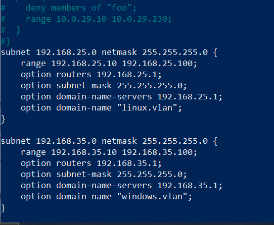

3. Edita el archivo `/etc/default/isc-dhcp-server` para especificar en qué interfaces debe escuchar el servidor DHCP:

   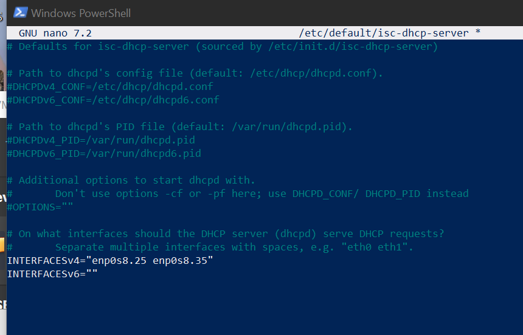

## Paso 5: Configurar VLANs

### Instalar y activar soporte para VLANs

1. Instala el paquete necesario para configurar VLANs:

   ```bash
   sudo apt install vlan
   ```

2. Asegúrate de que el módulo `8021q` está cargado:

   ```bash
   sudo modprobe 8021q
   ```

3. Configura las VLANs en el archivo `/etc/netplan/*.yaml`:

   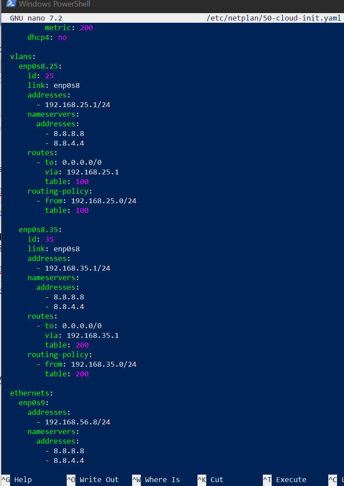

## Paso 6: Configurar SNAT para Conexión a Internet

### Habilitar el reenvío de paquetes en Linux

1. Edita el archivo `/etc/sysctl.conf` para habilitar el reenvío de paquetes IPv4. Descomenta la línea:

   ```conf
   net.ipv4.ip_forward=1
   ```

### Configurar reglas de iptables para SNAT

1. Asumiendo que `enp0s3` es la interfaz que está conectada a Internet, configura el NAT para que las VLANs puedan acceder a Internet:

   ```bash
   sudo iptables -t nat -A POSTROUTING -o enp0s3 -j MASQUERADE
   ```

2. Guarda las reglas de iptables para que persistan después de reiniciar el servidor:

   ```bash
   sudo apt install iptables-persistent
   sudo netfilter-persistent save
   ```

   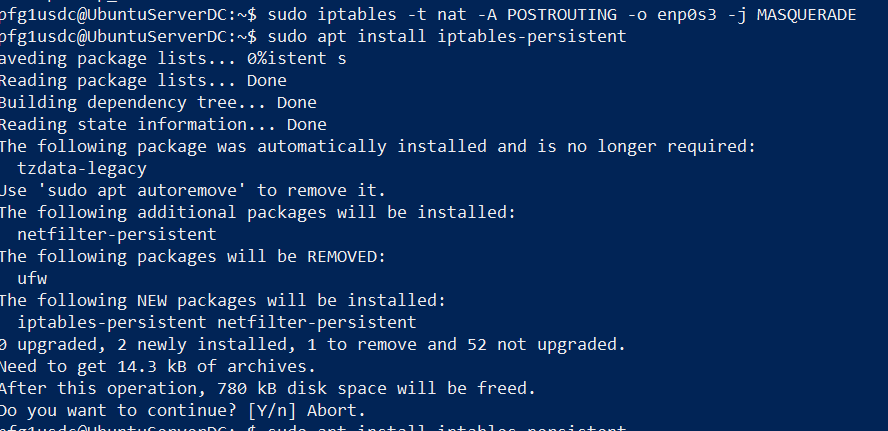

## Paso 7: Configurar el Servidor DNS

### Configurar Bind9 para resolver nombres locales

1. Edita el archivo de configuración `/etc/bind/named.conf.local` para agregar zonas de búsqueda directa para las VLANs:

   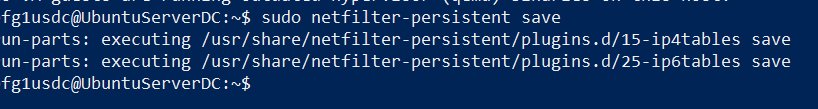

2. Edita `/etc/bind/db.linux.vlan` y `/etc/bind/db.windows.vlan`:

   ```bash
   sudo nano /etc/bind/db.linux.vlan
   ```

   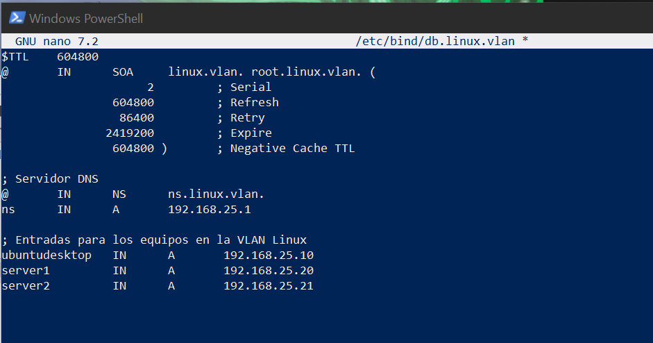

3. Verifica la configuración.
